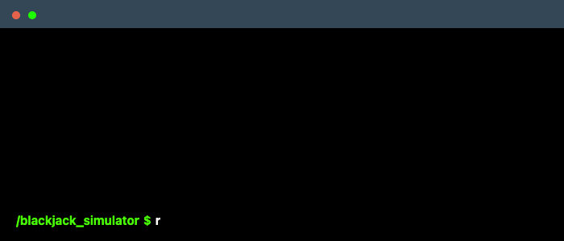

# Blackjack Simulator

This project is a Blackjack simulator implemented in Ruby that uses a Monte Carlo simulation to calculate the win probability of the player.

- [Getting Started](#getting-started)
  - [Installation](#installation)
  - [Usage](#usage)
- [Strategy](#strategy)
  - [Player's Hand (Hard)](#players-hand-hard)
  - [Player's Hand (Soft)](#players-hand-soft)
  - [Player's Hand (Pairs)](#players-hand-pairs)
    - [Hard vs. Soft](#hard-vs-soft)

## Getting Started

### Installation

```
git clone https://github.com/sashaobucina/blackjack_simulator.git
cd blackjack_simulator
```

### Usage



_Or run the simulation with a specific number of simulations_


## Strategy

### Player's Hand (Hard)

| Player's Hand | 2  | 3  | 4  | 5  | 6  | 7  | 8  | 9  | 10 | A  |
|---------------|----|----|----|----|----|----|----|----|----|----|
| 5             | H  | H  | H  | H  | H  | H  | H  | H  | H  | H  |
| 6             | H  | H  | H  | H  | H  | H  | H  | H  | H  | H  |
| 7             | H  | H  | H  | H  | H  | H  | H  | H  | H  | H  |
| 8             | H  | H  | H  | H  | H  | H  | H  | H  | H  | H  |
| 9             | H  | H | H | H | H | H  | H  | H  | H  | H  |
| 10            | H | H | H | H | H | H | H | H | H  | H  |
| 11            | H | H | H | H | H | H | H | H | H | H  |
| 12            | H  | H  | S  | S  | S  | H  | H  | H  | H  | H  |
| 13            | S  | S  | S  | S  | S  | H  | H  | H  | H  | H  |
| 14            | S  | S  | S  | S  | S  | H  | H  | H  | H  | H  |
| 15            | S  | S  | S  | S  | S  | H  | H  | H  | H  | H  |
| 16            | S  | S  | S  | S  | S  | H  | H  | H  | H  | H  |
| 17            | S  | S  | S  | S  | S  | S  | S  | S  | S  | S  |
| 18            | S  | S  | S  | S  | S  | S  | S  | S  | S  | S  |
| 19            | S  | S  | S  | S  | S  | S  | S  | S  | S  | S  |
| 20            | S  | S  | S  | S  | S  | S  | S  | S  | S  | S  |
| 21            | S  | S  | S  | S  | S  | S  | S  | S  | S  | S  |

### Player's Hand (Soft)

| Player's Hand | 2  | 3  | 4  | 5  | 6  | 7  | 8  | 9  | 10 | A  |
|---------------|----|----|----|----|----|----|----|----|----|----|
| A2            | H  | H  | H  | H | H | H  | H  | H  | H  | H  |
| A3            | H  | H  | H  | H | H | H  | H  | H  | H  | H  |
| A4            | H  | H  | H | H | H | H  | H  | H  | H  | H  |
| A5            | H  | H  | H | H | H | H  | H  | H  | H  | H  |
| A6            | H  | H | H | H | H | H  | H  | H  | H  | H  |
| A7            | S  | S | S | S | S | S  | S  | H  | H  | H  |
| A8            | S  | S  | S  | S  | S  | S  | S  | S  | S  | S  |
| A9            | S  | S  | S  | S  | S  | S  | S  | S  | S  | S  |
| AT            | S  | S  | S  | S  | S  | S  | S  | S  | S  | S  |

### Player's Hand (Pairs)

| Player's Hand | 2  | 3  | 4  | 5  | 6  | 7  | 8  | 9  | 10 | A  |
|---------------|----|----|----|----|----|----|----|----|----|----|
| 2,2           | Sp | Sp | Sp | Sp | Sp | Sp | H  | H  | H  | H  |
| 3,3           | Sp | Sp | Sp | Sp | Sp | Sp | H  | H  | H  | H  |
| 4,4           | H  | H  | H  | Sp | Sp | H  | H  | H  | H  | H  |
| 5,5           | H | H | H | H | H | H | H | H | H  | H  |
| 6,6           | Sp | Sp | Sp | Sp | Sp | H  | H  | H  | H  | H  |
| 7,7           | Sp | Sp | Sp | Sp | Sp | Sp | H  | H  | H  | H  |
| 8,8           | Sp | Sp | Sp | Sp | Sp | Sp | Sp | Sp | S  | S  |
| 9,9           | Sp | Sp | Sp | Sp | Sp | S  | Sp | Sp | S  | S  |
| T,T           | S  | S  | S  | S  | S  | S  | S  | S  | S  | S  |
| A,A           | Sp | Sp | Sp | Sp | Sp | Sp | Sp | Sp | Sp | Sp |

- **H**: Hit
- **S**: Stand
- **Sp**: Split
- **T** = Ten, Jack, Queen, or King

#### Hard vs. Soft

A hand is _soft_ when there is an Ace counting as 11. It's named such because you can't bust: you have one layer of protection.

For example, suppose you have an A,6 as your hand. This score is a _soft_ 17. If you hit and pull a 10, you don't bust but rather your A magically switches from 11 to 1. With the 10 added, the hand is now a _hard_ 17.

A hand is _hard_ when you have no layer of protection and therefore you are in jeopardy of busting if you draw a big card. This can happen a couple of different ways:

- Every Ace in your hand is already counting as 1 (not 11). The Ace can't magically switch to 1 to protect you, because it already is 1.
- You have no Aces in hand at all.
- A Ten plus a Seven is a Hard 17, because there's no flexibility here.

Those numbers can't magically take on a smaller value at your convenience.